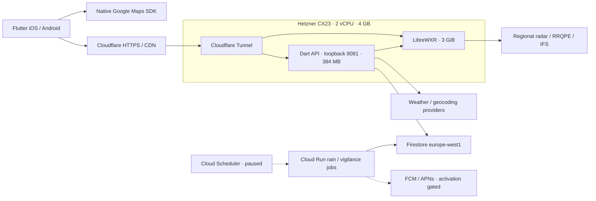

# Chetiwa production audit — 19 September 2026

Status: **verified fixes deployed; radar memory pressure and other public-launch blockers remain**.
This report separates deployed server fixes, app source changes, and remaining
release evidence. Existing uncommitted work was preserved. Nothing was published
to App Store or Google Play, and no purchases, provider contracts, or paid backup
subscriptions were activated.

## Release preparation resumed — 30 September 2026

The owner requested the launch steps in order and explicitly rejected assuming
permission to scale. The server remains CX23 / 2 vCPU / 4 GB, with its existing
3 GiB radar allowance. No rescale, paid option, firewall change, or Store
publication has been applied in this follow-up. Existing administrator SSH
access works. The API image is unchanged and `/readyz` still reports `staging`.
The radar received the code-only allocation fix recorded below. The September
19 sections are retained as history; their undeployed-candidate status and
paid-upgrade proposal are superseded by this follow-up.

Local release preparation now pins the mobile toolchain and validates Android
bundle structure, manifest and upload signatures before retaining a candidate.
The 11 release-tool tests passed. No Android upload key is configured locally,
so no signed AAB was built. The privacy/declaration drafts now distinguish
installed-device identifiers from anonymous data and no longer promise an
unconfigured 180-day device TTL. The Firestore provisioning script only enables
the approved metrics TTL; three mocked-CLI regression tests verify that other
retention policies are not changed. These are local changes, not evidence of
completed store declarations or a live cloud deployment.

The 17:49:33–18:04:33 UTC baseline still failed the memory screen: radar reached
3,071.9 MiB of its 3,072 MiB allowance, added 3,129 memory-limit events, and
showed peak memory PSI of 15.77%. Radar swap was 999.5 MiB at the start and
1,068.2 MiB at the end; host swap I/O p95 was 14.993 MiB/s. No OOM occurred.
The window included IFS ingestion and completed refreshes, with six forecast
frames restored after two observed publication transitions. See the
[baseline assessment](../../tmp/launch-2026-09-30/capacity-before-report.json)
and [phase evidence](../../tmp/launch-2026-09-30/capacity-before-summary.json).

After independent review, row-bounded float32 flow clamping was deployed as
radar release `20260930T180539Z-29515`, image
`sha256:659e98003ff3bd07beb9562b281b39341297de6e0fef446046b70035f42655d1`.
It retains the same resolution, data sources and 512-row remap behavior, while
avoiding full-field clamp temporary arrays for float32 flow. Other dtypes keep
their previous clamp behavior. The deployment health check passed; the exact
prior image is retained as
`chetiwa-librewxr-coordinate-rollback:20260930T180539Z-29515`, with the source
backup under `/opt/chetiwa/librewxr-coordinate-backups/20260930T180539Z-29515/`.
No VM size, container memory allowance, paid service or data configuration was
changed. See the [deployment log](../../tmp/launch-2026-09-30/row-clamp-deploy.log).

Pre-deployment verification used Linux/amd64 with Python 3.12.14, NumPy 2.5.2
and OpenCV 5.0.0, matching the production version numbers. The local ARM64
host emulated x86_64; its compiler/runtime and CPU were not the exact production
image. Results were:

- 3,848 byte-identical finite native outputs, eight matching unsupported-map
  rejections, 7,712 input-preservation checks and 178,976 destination-buffer
  alias checks.
- A separate bounded matrix at `max_px=2` returned identical native outputs
  for all 16 mixed finite/NaN/infinity/signed-zero cases, with wrapping on/off,
  7/512-row blocks, uint8/float32 frames and below-/above-cap blocks. No native
  crashes, rejections or timeouts occurred in this matrix. Its 48 remap calls
  also matched exact source/map bytes and parameters independently. This does
  not resolve or claim to exhaust the older macOS `max_px=None` native failure.
- Three isolated 2000×4000 benchmarks reduced peak RSS from 335.87–336.02 MiB
  to 202.168–202.172 MiB, a median 133.84 MiB reduction, with identical output
  checksums within each run. These are local allocation measurements, not
  production latency or complete-workload capacity results.
- Syntax and exact patch application/reversal checks passed, together with
  all 63 deployment-controller regression tests, including rollback paths.

Evidence: [finite and memory validation](../../tmp/launch-2026-09-30/row-clamp/validation-summary.json),
[separate nonfinite validation](../../tmp/launch-2026-09-30/row-clamp/nonfinite-validation-summary.json)
and [controller test result](../../tmp/production-audit/row-clamp-controller-tests.log).
The local validation files preserve their pre-deployment `UNAPPLIED` labels;
the deployment log above records the subsequent release.

**Capacity remains unapproved on the existing server.** The follow-up recorder
was deliberately stopped after 922.6 seconds / 92 samples because a warm
refresh already exceeded the unchanged conservative 90% RAM-headroom screen.
Sampled usage reached 2,828.5 MiB and the kernel lifetime peak increased to
3,061.6 MiB of the 3,072 MiB limit. No new memory-limit or OOM events occurred
in this window. Radar memory PSI peaked at 4.18% (p95 1.81%); host memory PSI
peaked at 5.23% (p95 1.66%), also exceeding the unchanged pressure screen.
This does not establish improvement
under the full workload: the old and new windows differ, and the new one did
not include hourly IFS ingestion. Restarting the container also resets its
cumulative counters.

The [partial assessment](../../tmp/launch-2026-09-30/capacity-after-partial-assessment-20260930T182509Z.json)
is explicitly incomplete and does not approve capacity. The
[raw partial recording](../../tmp/launch-2026-09-30/capacity-after.jsonl)
retains its `interrupted` marker and initial zero-forecast samples. Four past
and six forecast frames were first observed about 86 seconds after container
start; the first 65 seconds were not recorded. Three nowcast/refresh completions
were captured in [separately collected phase evidence](../../tmp/launch-2026-09-30/capacity-after-phases.jsonl).
Only the verified recorder process was interrupted; it exited and no matching
recorder remained. No server container was stopped by that cleanup. A complete
hourly workload and representative sustained traffic still require validation
after sufficient memory headroom is demonstrated. Scaling is not the active plan.

The post-fix public probe passed ten PNG tile reads, with a slowest response of
0.196 seconds. A separate bounded origin check passed twelve observed/forecast
tile reads at concurrency four, with a slowest response of 0.601 seconds. These
are smoke checks, not a production traffic capacity estimate. The API remained
ready in `staging`.

The Android 14/API 34 emulator passed the native Maps radar outage/recovery
integration scenario. The normal debug app was restored through replace-install
and its installed APK verified; no uninstall or emulator reset occurred. This
does not validate Firebase bootstrap, notifications, distribution signing or
physical-device performance. See the [private test summary](../../tmp/launch2026-09-30/android-radar-recovery.md).

Read-only Play Console inspection of the supplied developer Google account
`2mohamedelasri@gmail.com` reached the developer-account creation page. No account,
signing identity or app listing was created. Whether an existing Play developer
account uses another email is awaiting owner clarification.

## Antwerp radar comparison — 30 September 2026

The owner reported an excessive red overlay compared with Drops. The supplied
screenshots select different forecast times: Drops 20:55 and Chetiwa 21:10
(Europe/Paris). They also do not establish an identical coordinate, forecast
generation or upstream product. Neither screenshot alone determines ground
rainfall accuracy.

The live scheme-14 palette is a confirmed presentation cause. A previous patch
changed neutral weak-echo bands to warm/red, including 14 dBZ (approximately
0.3 mm/h under this service's conversion). In the subsequently sampled Antwerp
21:10 forecast tile, 46,169 of 46,605 nonzero pixels (99.06%) were below 28 dBZ;
none reached 34 dBZ. The same encoded field rendered with the older palette
appeared predominantly grey. The raw-to-palette mapping was checked over all
65,536 pixels for both an observed and a forecast tile. This confirms a colour
mapping difference, not agreement with Drops or independent rain-gauge truth.
See the [raw/palette comparison](../../tmp/radar-accuracy-2026-09-30/antwerp-color-vs-raw-verification.json).

The sampled Antwerp coverage mask was true and its nowcast feather weight was
1.0. The deployed renderer protects covered dry pixels from model fill, and
the point sampler also treats covered zero as dry radar. An upstream comment
suggesting all dry pixels fall through to ECMWF therefore did not describe the
sampled live behavior. OPERA MAX reflectivity and radar extrapolation were in
use here. The latest memory-optimization module matched the source already
validated for equivalent outputs; no new loss of spatial resolution was found.

A separate app correctness issue was found: a geographic tile fallback could
return pixels from a previous frame/run/palette after a timeout and count them
as ready for the newly requested URL. Selected-time labels could also advance
ahead of the native front image. The app correction retains exact tile identity
and keeps displayed time, value and provenance with the retained front frame
until promotion. Point-enrichment failure is labelled as weather-model fallback,
rather than claiming that all graph values are exact radar samples. Incoming
native layers still stage over the front layer during handoff; this change does
not establish atomic native compositing or same-generation consistency between
separately fetched point samples and map metadata.

The correction uses a new neutral palette ID 15, preserving legacy palette 14
and the raw weather field. The new ID is necessary because origin PNG caches
include the colour ID but ignore the presentation query. API and new direct-app
URLs use `presentation=neutral-v1` as well.

Palette release `20260930T190112Z-41464` completed successfully, with the prior
image and two source files retained for rollback. API release
`20260930T190608Z-42002` also passed local and public health checks. At 19:08 UTC,
all ten public API frame URLs used the new presentation, and LibreWXR advertised
palette 15 with four observed and six forecast frames. The existing prewarm
script was updated to the same palette and a distinct warmed-state file; its
timer, target count and service configuration were unchanged. The bounded public
probe passed ten PNG responses across five representative coordinates through
the CDG edge, with repeat HIT latency 49–145 ms. This verifies delivery and cache
behavior, not rainfall accuracy or performance from five geographical regions.
See the [radar deployment log](../../tmp/radar-accuracy-2026-09-30/neutral-palette-deploy.log),
[API deployment log](../../tmp/radar-accuracy-2026-09-30/api-palette-deploy.log) and
[public probe](../../tmp/radar-accuracy-2026-09-30/public-palette-probe.jsonl).

Independent post-deployment verification found the saved Antwerp 18:40 UTC raw
observation PNG byte-identical before and after deployment. All 65,536 decoded
pixels matched the respective palette LUTs, with the same visible footprint;
the sampled public API PNG also matched the palette-15 origin PNG byte-for-byte.
Radar and API memory/swap/CPU limits matched the pre-deployment values. An
independently captured API environment hash, excluding only the tile URL
template, matched across the API replacement. This does not independently prove
every historical radar environment entry: the earlier radar environment hash's
serialization was not retained. See [live verification evidence](../../tmp/radar-accuracy-2026-09-30/neutral15-live-independent-verification.json).

Validation passed 203 Flutter tests, 126 backend tests, 15 palette-controller
cases and 11 full-source palette checks. The palette checks also passed on the
matching Linux runtime (ten checks; one Git-dependent check passed on the host).
The eight API deployment/rollback checks and seven direct-repository checks
passed. Flutter analysis reported no issues.

The first Android outage replay exposed an intermittent playback-recovery
failure despite exact tiles becoming available and the selected native front
having 18/18 successful requests. A diagnostic-only repeat passed, so that
single success was not used to close the finding. The follow-up app correction
reconciles playback after native promotion and makes the BLoC preserve explicit
pause intent while allowing a readiness retry rejected during suspension.
Four new regressions cover recovery, intentional pause and background behavior.
The strengthened final Android API-34 debug-emulator replay passed in 33.0
seconds: recovery without remembered playback intent advanced frames, and an
intentional pause survived a subsequent native frame promotion. The normal
entrypoint APK was restored and its installed bytes matched SHA-256
`b19dc3bcdedf7f016089aa61907db8f11df2274fe87a5e83008bd0b91a195270`.
The test did not uninstall/reset the app. It cleared radar disk cache and
temporarily changed four Flutter preference keys; exact pre-run Flutter
preferences were restored. One Google Maps initialization key changed as runtime
state. This replay excludes Firebase bootstrap and does not establish physical
device performance or release-signing readiness. See the [Android replay result](../../tmp/launch2026-09-30/radar-temporal-validation/android-radar-summary.json)
and [test APK](../../tmp/launch2026-09-30/radar-temporal-validation/android-normal-main-debug.apk).
The new app code has not been installed on the owner's physical phones.

Actual upstream observation age remains a separate validation concern: OPERA
can select an older published slot and regional fetch logic can carry data
forward. This audit does not establish that those paths occurred in the owner's
screenshots or certify a forecast's meteorological precision. A matched-time,
matched-coordinate comparison against observations is still required.

## Architecture actually in use

There are no Cloud Run web services in the inspected project. The API and radar
run on Hetzner; Cloud Run hosts the notification jobs. Replacing this architecture
is not necessary for the verified app race conditions or redundant requests.
The small server remains a single point of failure and requires measured capacity
headroom before a larger rollout.

## Causes of lag and incorrect behavior

| Observed issue | Correction | Scope |
| --- | --- | --- |
| Older forecast/location responses overwrote a newer city selection | Request generations and lifecycle guards; shared startup restore; storage-error fallback | App source, tested |
| A delayed radar refresh undid pause/background suspension | Playback follows the latest intent and explicit suspension state | App source, tested |
| Physical iPhone outage recovery resumed before the native surface was ready, then became stuck suspended | One readiness/foreground/coverage gate preserves resume intent until the map can present it | App fix and strengthened regression; final phone replay pending unlock |
| Response bodies could stall beyond the app deadline | Complete API write response uses one 15-second deadline | App source, tested |
| Concurrent cache misses duplicated upstream work | Shared in-flight JSON loads, retaining per-request ETag handling | API deployment |
| Provider retries outlasted the phone timeout | One 12-second provider budget and transport cancellation on timeout | API deployment |
| Radar coordinate arrays and full-frame remap workspaces wasted memory | Direct float32 allocation, sparse axes and remapping in 512-row chunks reduce temporary allocations without changing resolution | Deployed and pixel-equivalent in 5,760 chunked-remap cases; live memory pressure persists |
| Immediate repeat CDN MISS caused false monitoring failures | Bounded cache-convergence rounds; still rejects bad PNG/status/cacheability/latency | Probe source, live validated |

Before changes, the radar cgroup had reached its 3 GiB ceiling repeatedly,
retained about 1.11 GiB of swap, and showed memory/I/O pressure during ingestion.
This is evidence of memory pressure, not proof of a monotonically growing leak.
The float32, sparse and chunked-remap changes save allocations; they do not by themselves prove
that all memory pressure or all user-visible lag has disappeared. See the final
measurement section below and the [memory evidence](../../tmp/production-audit/server-memory.md).

## Reliability and security fixes

- Radar frame paths now preserve the configured provider origin, reject invalid
  encoding and traversal/authority forms, and do not follow redirects.
- Public provider errors no longer include upstream exception URLs that might
  contain a provider credential.
- Radar owner/session tracking is bounded, tile-cache byte limits are strict,
  and network limits supplement caller-selected device IDs.
  Request/network buckets are per process, reset on restart, and are not
  distributed DDoS protection. Local session quotas also reset without a
  configured shared guard; paid enforcement requires verified identity.
- Cloudflare identity is trusted only on this protected tunnel origin. Local
  prewarming supplies the required loopback identity; arbitrary X-Forwarded-For
  does not select the network bucket.
- The five-alert limit is enforced with an atomic, version-checked commit.
  Concurrent creation cannot exceed it.
- Device erasure first disables the device and removes its push token, fences
  concurrent writers, removes private state in resumable batches, and finally
  removes the parent. Stale updated workers cannot recreate erased state.
- Shared polling-cell wakeups commit atomically with subscription changes.
  A stale updated worker cannot overwrite or delete a newer wakeup; the old
  Cloud Run worker images do not yet honor this protocol.
- API deployment pins the exact running image for rollback, uses a deployment
  lock and private staging, and verifies health. Eight controller scenarios
  cover success and seven failure/signal/collision cases.
- Docker builds now copy only compilation inputs and exclude nested environment
  files. The previous broad build context could retain a server environment file
  in local intermediate cache. No external upload or final-image credential-file
  disclosure was established; final images copy only four compiled binaries.
- Mobile release CI now requires source checks and validates version, build
  number and public HTTPS API origin before packaging.

The source audit found and fixed three medium security findings. It was a scoped
review, not an exhaustive certification of every file or all account IAM.
See the [security report and coverage](../../tmp/production-audit/codex-security/report.md)
and [subsequent corrections](../../tmp/production-audit/security.md).

## Live infrastructure and cost controls

| Item | Verified state |
| --- | --- |
| Hetzner | chetiwa-librewxr-01, CX23, Nuremberg, 2 vCPU / 4 GB / 40 GB |
| OS recovery | Restarted into installed kernel 7.0.0-31-generic; all containers and watchdog/prewarm/storage timers recovered; no failed systemd units |
| Origin ingress | API bound to loopback; Hetzner firewall blocks public HTTP origin access; Cloudflare Tunnel serves public HTTPS |
| Accidental deletion | Hetzner delete/rebuild protection and Firestore deletion protection enabled |
| Recovery copies | Paid Hetzner backups left disabled at the owner's request; Firestore backup schedules and PITR remain disabled |
| Firestore retention | Only alertRunMetrics.expiresAt TTL is ACTIVE, approved by owner. Code stores expiry at run start + 30 days. Other collection TTLs remain disabled |
| Monitoring | Two Google HTTPS uptime checks, API health and radar metadata, every 5 minutes from three regions with TLS validation |
| Notification jobs | Both five-minute schedules paused; both worker ENABLED and SEND flags false. No real push sent during the audit |
| Features | API remains staging; paid features and ads disabled. Public-release provider configuration is still gated |

The original alert was a real Cloud Run spend cap: €5.03 of €10 with a €9.01
September forecast before intervention. The cap can suspend Cloud Run at 100%;
it is not just an email threshold. The €10 limit was retained. Fifteen inspected
rain executions had zero active alerts and zero pushes, so their five-minute
schedule was paused to stop unnecessary execution cost. Billing updates can lag;
these displayed costs are not a final invoice.

The vigilance schedule had stale August activity despite appearing enabled.
After a controlled pause/update/resume, an automatic execution at
2026-09-19T11:00:00.991Z completed in shadow mode with zero pushes. It was then
paused again. The reset repaired observed scheduling behavior; the original
cause of the stale state was not established.

After verification, both old jobs were also disabled at their worker entrypoint
(`RAIN_ALERTS_ENABLED=false` / `VIGILANCE_ALERTS_ENABLED=false`), with both SEND
flags false. This protects against accidental manual invocation of old logic.
The existing images remain unchanged pending the source-transfer approval below.

Do not resume or manually execute the old worker images, even in shadow mode:
shadow execution still writes private state. Drain any old executions before
replacement. Both require the updated erasure protocol,
and the rain worker also requires version-aware cell scheduling. Use the
[activation runbook](../backend/smart-rain-alerts-runbook.md), update images while
paused, and verify shadow execution before any push activation.

Metric TTL eventually cleans diagnostics that have a valid expiry timestamp;
it is not an exact deletion deadline or proof that historical records were
backfilled. It is not a speed fix and
does not remove saved alerts or device records. Deleted metrics are not
recoverable through a configured backup. Delete protection prevents accidental
database/server deletion; it does not replace a restore-tested backup.
The retained deployment source/image copies live on the same server and do not
recover a lost host or disk.

Runtime presence checks confirmed no Open-Meteo commercial key and no ArcGIS
key are currently configured. City search returned HTTP 200 in 832 ms, while a
fixed-coordinate reverse lookup returned HTTP 503 with
`reverse_geocoding_not_configured`. The app preserves exact coordinates and
uses a usable generic pin/GPS label; descriptive place naming is degraded.
Credential values were never printed. The working staging forecast is not
evidence of approved production provider use.

The Maps iOS key is restricted to com.ezplatforms.chetiwa and the iOS Maps API;
the Android key has the same package plus a certificate restriction and the
Android Maps API. Matching the certificate to the final Play app-signing key
remains a release check. Key values were not printed or changed.
The deployed Firestore Rules release, updated 25 August, was read through the
Rules API and independently confirmed `allow read, write: if false` for all
documents. Mobile clients cannot bypass the backend through those rules.

The API runtime service account has `roles/datastore.user`; the notification
worker has that role plus `roles/firebasecloudmessaging.admin`. No project IAM
binding grants `allUsers` or `allAuthenticatedUsers` access. The default Compute
service account still has the broad `roles/editor` role and is the confirmed
Cloud Build identity, including the latest successful build. Narrowing that
build identity requires a verified build with the replacement permissions;
removing its current role without that check could break deployment. Project
IAM was inspected, not all inherited or individual-resource policies.

## Validation and evidence

- **188 Flutter tests passed**; whole-repository Flutter analysis clean.
- **126 backend tests passed**; Dart analysis and changed-file whitespace checks
  clean. This includes concurrent creation, resumable deletion and stale-worker
  scheduling regressions with independent review.
- The initial iOS simulator live radar outage/recovery test passed with native Maps. A
  new-location outage escaped the loading state within the 12-second test
  deadline, with pause and recovery preserved. A later physical iPhone test
  exposed a recovery ordering race; its fix and final result belong in the
  completion section and supersede simulator-only confidence.
- Radar probe passed 12 tile samples across five city coordinates from one
  Morocco client. Slowest MISS was 348 ms; slowest HIT was 183 ms. Different
  Cloudflare POP routing required a third attempt for two cities. These are
  sampled timings, not global latency guarantees.
- After the final API deployment, fixed-Paris reads returned HTTP 200: forecast
  MISS 366 ms / HIT 241 ms, radar metadata 161 ms and point-nowcast 1168 ms. Four observed/
  forecast tile reads returned valid PNG / HTTP 200 in 89–409 ms, including an API
  cache HIT and a CDN HIT. Google uptime checks subsequently passed in all three
  configured regions for both endpoints.
- Deployment and probe controllers have mocked failure-path coverage; the
  coordinate patch has numerical equivalence and apply/revert checks.

Physical-phone results, final memory observations, deployment identifiers and
audit-access cleanup are recorded in the completion section below.

## Remaining public-release gates

| Gate | Required evidence or action |
| --- | --- |
| Provider rights | Archive commercial and redistribution/cache permissions for Open-Meteo and every active radar data source; configure the approved production provider credentials |
| Legal/public contact | Confirm legal entity and public support/privacy contact; publish completed privacy/terms pages. ezplatforms.com is a supplied website, not proof of a legal entity; the supplied developer email was not automatically published |
| Signed device release | Complete the existing physical-device checklist, including Android, permission/offline/accessibility cases, actual production bootstrap, and final Store-signed builds |
| Push | Deploy updated workers, verify opt-in and deletion, APNs/FCM delivery and quiet hours on a real opted-in device, then deliberately activate within an agreed budget |
| Paid features | Keep disabled until server-verified receipts, expiration/refunds/revocation, restore and shared server-owned quota accounting are implemented and tested |
| Capacity/recovery | Resolve the measured memory pressure, then verify headroom across hourly IFS ingestion and representative traffic; establish a restore-tested recovery procedure before relying on persistent production data |
| Operations | Route uptime failures to a confirmed responder and test the alert. Created checks alone do not establish an incident-response process |
| Build permissions | Replace the default build account's broad Editor role with tested build-specific permissions and verify the source-build/deploy flow |

The [public-launch gate](../compliance/public-launch-gate.md),
[private-beta checklist](private-beta-checklist.md), and
[physical-device checklist](physical-device-smoke-test.md) remain authoritative
release criteria. No contract, purchase validation, app-store publication, or
unavailable-device test is implied by passing the automated tests.

## Completion evidence

API release `20260919T111446Z-4854` passed deployment health checks. The running
image is `sha256:93745ac291bc7d9f28a54bc326c844512aea1238117be1bae50669ed4c748459`.
Exact previous image and source were retained. Old local Docker build cache was
pruned after successful deployment, reclaiming 2.998 GB; running/rollback images
were retained. See `tmp/production-audit/api-final-deploy.log`.

Radar release `20260919T114748Z-29074` installed the third allocation fix,
512-row remapping, using image
`sha256:b4c8aa1c79b14923e738dd17797b0bd38fd6c6ab2493f84c6b7f0b0082651cd8`.
The exact previous sparse-grid image and source are retained for rollback.
All 27 deployment-controller scenarios passed, including rollback paths;
the three-patch application/compile/reversal chain reproduced the original
source exactly. Native remap validation passed 5,760 byte-identical cases.
The post-deployment public probe at 11:58 UTC passed 11 tile samples across five
city coordinates with four past and six future frames, all valid PNG / HTTP 200,
and a slowest sample of 452 ms. This confirms sampled service behavior, not
capacity under concurrent production traffic.

**The current server still fails the memory-headroom gate.** In the complete
11:50:17–12:04:26 UTC observation, all four past and six future frames published,
but radar reached its 3 GiB ceiling and recorded 931 additional memory-limit
events. Swap rose from 54 to 866 MiB; sampled memory PSI reached 19.55%.
There were no OOM events or killed processes. This cycle also refreshed four
hourly IFS timesteps, unlike the preceding sparse-only comparison, so the event
counts cannot establish a regression caused by chunked remapping. The fixes
reduce proven allocations and preserve image output; they have not removed the
measured live pressure. Further measured resident-memory reductions or an
approved capacity increase, followed by representative load testing, are required
before production capacity can be signed off. No paid server resize was made.

The live Hetzner rescale quote offers CX33 with 4 vCPU / 8 GB RAM for
€8.49/month, compared with the current CX23 at €5.49/month: **€3/month more,
excluding VAT**. CPU-and-RAM-only rescaling preserves the 40 GB disk and allows
a later downgrade; the server must be stopped for the change. The proposed
follow-up is to rescale, raise the radar container's memory allowance within the
new host capacity, and repeat the complete refresh/traffic measurements.
Owner approval for the charge, downtime and temporary verification access was
requested and is pending. No rescale option was applied or server stopped.
Quote source: [Hetzner server rescale](https://console.hetzner.com/projects/15777275/servers/163183974/rescale).
The [prepared capacity procedure](../backend/hetzner-capacity-upgrade.md) starts
with a 5.5 GiB radar allowance only if measured host RAM leaves 384 MiB for the
API and at least 1.5 GiB for the operating system/tunnel/monitoring. It also avoids
the full-profile installer, which would reset the limit to 3 GiB. No capacity
configuration change has been deployed.

One further flow-clamp candidate is isolated under `tmp/production-audit` and
is **not integrated or deployed**. It clamps float32 flow within destination-row
blocks, retaining the previous full-field behavior for other dtypes. Local
NumPy comparisons and source apply/reverse checks support the arithmetic.
A temporary local environment now has official NumPy 2.5.2 and OpenCV 5.0.0
wheels. The initial native suite crashed in the existing baseline's remap with
synthetic non-finite wrapped flow; no production occurrence was established.
In a separate finite-input 2000×4000 test, the candidate produced the identical
image checksum with peak RSS 189.22 MiB versus 347.48 MiB for the baseline.
That single macOS measurement is not evidence of the server's resulting peak
or proof that clamping caused the live pressure. The separate finite suite
passed 3,848 exact native-output comparisons plus eight matching unsupported-map
rejections; input preservation and destination-buffer checks passed. Isolated
non-finite reproductions still terminated both baseline and candidate inside
OpenCV and count as zero passing comparisons. Full-matrix and Linux validation
remain incomplete. This candidate is not counted among the verified deployed
fixes or as a reason to remove the capacity gate. See its
[validation status](../../tmp/production-audit/row-clamp-candidate-structural-validation.json).

The physical iPhone revealed the ordering race described above. After correction,
the strengthened native simulator scenario passed in 47 seconds after a 74-second
build. It verifies no premature playback, recovery and subsequent frame
advancement. The fixed physical replay timed out during launch/VM attachment
while the phone was locked; wireless discovery also reported a warning. Its
bounded runner stopped after 360 seconds. The normal development-signed
`lib/main.dart` profile app, without the smoke-test flag, was then restored using Apple's paired
device update with no uninstall or data clearing. Physical pass/performance
sign-off remains pending unlock; no Android device was available. These tests
also exclude Firebase startup and native Maps compositor frame-time analysis.

The Google worker source archive is prepared and credential-free, but was not
uploaded. Automatic approval review rejected the transfer because the earlier
Cloud Shell authorization covered inspection rather than sending internal
source. The specific upload/build/update approval is pending. Both jobs remain
disabled and their schedulers paused; no alternate transfer was attempted.

All server measurement sessions exited. The temporary audit source
`160.179.244.112/32` was removed from the Hetzner firewall, and the console
confirmed **Fully applied** with only the original `82.65.100.242/32` SSH source,
TCP port 22. No other inbound rule was added.

At 12:07:08 UTC, after access cleanup, public API health/readiness and radar
metadata returned HTTP 200, with four past and six future frames. A tile from the
newly published 12:00 frame returned a valid PNG / HTTP 200 in 459 ms. API
readiness still explicitly reports `staging`. Evidence:
[final public health](../../tmp/production-audit/final-public-health.json).

## Live physical Android radar playback — 30 September 2026

The active Chetiwa session was on the connected Xiaomi M2011K2G (Android 12 /
API 31), while the connected Android emulator was running another application.
Flutter's VM service confirmed **PROFILE MODE** before and after this correction.
The observed problem therefore cannot be attributed solely to the previous
debug run configuration.

A 40-second Paris recording showed 14 unintended backward cursor jumps of
88–226 pixels, in addition to the intended end-of-loop wraps. Native layer
handoff and speculative prefetch reset the visual controller to zero; the
pending-image timeline also snapped to the retained image's original timestamp.
The correction preserves the interpolation phase through these holds and
automatic viewport recovery, and resumes the BLoC clock with the remaining
frame duration. Time, point value and provenance labels still describe the
retained front image until promotion; explicit user pause remains respected.

All 205 Flutter tests passed, including cursor continuity and remaining-duration
regressions. Static analysis and whitespace checks passed. The corrected normal
`lib/main.dart` Premium API profile APK was replace-installed without clearing
app data. Its installed SHA-256 matched the saved build:
`78b8fe5e59b1eefc6b48a15b87dd6cd8d20be8b36970f2635f2584e4ade9ca36`.

The final 120-second Antwerp capture completed seven loop wraps and showed no
large phase-reset jumps. One 14-pixel change coincided with the chart's visible
start updating from 22:38 to 22:39; this is distinct from the original full-step
rewinds. Two controlled horizontal pans exercised viewport recovery. Normal
label changes had a median interval of 2.25 seconds, and the pans produced gaps
of **5.45 and 3.65 seconds**. The proposed no-hold-over-three-seconds target was
therefore **not met**. The player still holds each source image for two seconds,
then waits on tile preparation and native layer handoff; this correction does
not create continuous rain-cell motion or remove buffering after map movement.
The relative contribution of network loading, native request coverage and
compositor work to the recovery gaps has not been separately measured.

No permanent freeze was reproduced in these bounded observations. Cold load,
larger zoom changes, outages, lifecycle transitions and physical iOS performance
remain outside this playback check. The two locations and forecast generations
differ, so these recordings are not a controlled precipitation-accuracy or
provider comparison. Server capacity, billing and providers were unchanged.
See the [measured playback summary](../../tmp/emulator-animation-2026-09-30/live-radar-audit-summary.json)
and [final recording](../../tmp/emulator-animation-2026-09-30/phone-final.mp4).

## References

- [Google spend caps](https://docs.cloud.google.com/billing/docs/how-to/budgets-spend-caps)
- [Firestore TTL](https://cloud.google.com/firestore/docs/ttl)
- [Docker build-context exclusions](https://docs.docker.com/build/concepts/context/#dockerignore-files)
- [Cloudflare cache response statuses](https://developers.cloudflare.com/cache/concepts/cache-responses/)
- [Backend evidence](../../tmp/production-audit/backend.md)
- [App evidence](../../tmp/production-audit/app.md)
